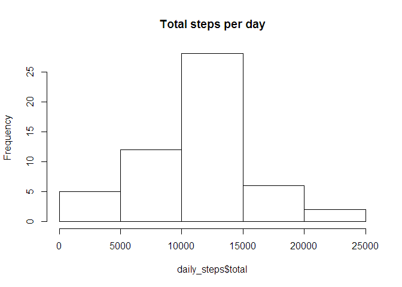
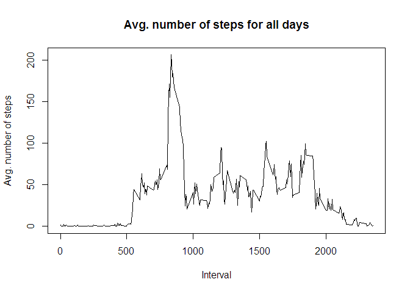
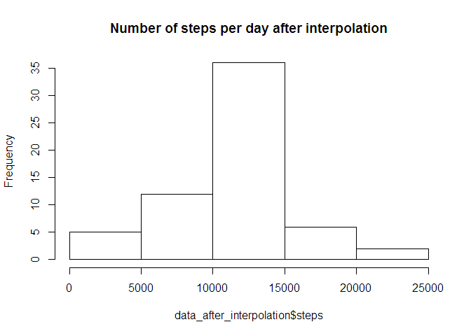
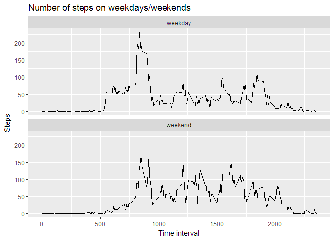

# Course 5 project
Mikhail Chepkiy  
6 November 2017  


## Loading and preprocessing the data

```r
    data <- read.csv("activity.csv")
    # remove NAs
    data_clean <- data[!is.na(data$steps),]
```

## What is mean total number of steps taken per day?

```r
    library(dplyr)
```

```
## Warning: package 'dplyr' was built under R version 3.4.2
```

```
## 
## Attaching package: 'dplyr'
```

```
## The following objects are masked from 'package:stats':
## 
##     filter, lag
```

```
## The following objects are masked from 'package:base':
## 
##     intersect, setdiff, setequal, union
```

```r
    grouped <- group_by(data_clean, date)
    daily_steps <- summarize(grouped, total = sum(steps))
    hist(daily_steps$total, main="Total steps per day")
```

<!-- -->

## Mean and median number of steps taken each day

```r
    summary(daily_steps)
```

```
##          date        total      
##  2012-10-02: 1   Min.   :   41  
##  2012-10-03: 1   1st Qu.: 8841  
##  2012-10-04: 1   Median :10765  
##  2012-10-05: 1   Mean   :10766  
##  2012-10-06: 1   3rd Qu.:13294  
##  2012-10-07: 1   Max.   :21194  
##  (Other)   :47
```
**mean = 10766, median = 10765**

## Time series plot of the average number of steps taken
1. Time-series plot

```r
    interval_steps <- aggregate(steps ~ interval, data, mean)
    plot(interval_steps$interval, interval_steps$steps, type='l', 
      main="Avg. number of steps for all days", xlab="Interval", 
      ylab="Avg. number of steps")
```

<!-- -->
2. Which 5-minute interval, on average across all the days in the dataset, contains the maximum number of steps?

```r
  max_steps <- which.max(interval_steps$steps)
  interval_steps[max_steps, ]
```

```
##     interval    steps
## 104      835 206.1698
```
**interval 835 contains ~206.2 steps on average which is MAX**

## Code to describe and show a strategy for imputing missing data

1. Calculate and report the total number of missing values in the dataset (i.e. the total number of rows with NAs)


```r
    sum(is.na(data))
```

```
## [1] 2304
```
**2394 NAs found**

2. Devise a strategy for filling in all of the missing values in the dataset. The strategy does not need to be sophisticated. For example, you could use the mean/median for that day, or the mean for that 5-minute interval, etc.

Suggest interpolating the missing values with mean()

```r
    data_interpolated <- data
    for (i in 1:nrow(data_interpolated)) 
    {
        if (is.na(data_interpolated$steps[i])) 
        {
            interval_value <- data_interpolated$interval[i]
            steps_value <- interval_steps[interval_steps$interval == interval_value,]
            data_interpolated$steps[i] <- steps_value$steps
        }
    }
```

3. Create a new dataset that is equal to the original dataset but with the missing data filled in.


```r
    data_after_interpolation <- aggregate(steps ~ date, data_interpolated, sum)
```

4. Make a histogram of the total number of steps taken each day and ... 


```r
    hist(data_after_interpolation$steps, main = "Number of steps per day after interpolation")
```

<!-- -->

Calculate and report the mean and median total number of steps taken per day. 


```r
    mean(data_after_interpolation$steps)
```

```
## [1] 10766.19
```

```r
    median(data_after_interpolation$steps)
```

```
## [1] 10766.19
```

```r
    mean(data_after_interpolation$steps) - mean(daily_steps$total)
```

```
## [1] 0
```

```r
    median(data_after_interpolation$steps) - median(daily_steps$total)
```

```
## [1] 1.188679
```
Do these values differ from the estimates from the first part of the assignment? What is the impact of imputing missing data on the estimates of the total daily number of steps?

**Mean is the same, median is slightly higher**

5. Are there differences in activity patterns between weekdays and weekends?


```r
    # add weekdays
    data_interpolated['weekday'] <- weekdays(as.POSIXct(data$date))
    data_interpolated$weekday[data_interpolated$weekday %in% c('Saturday','Sunday')] <- "weekend"
    data_interpolated$weekday[data_interpolated$weekday != "weekend"] <- "weekday"
    data_interpolated$weekday <- as.factor(data_interpolated$weekday)

    # avg. steps by interval split by weekdays/weekends
    data_interpolated_intervals <- aggregate(steps ~ interval + weekday, data_interpolated, mean)
    library(ggplot2)
```

```
## Warning: package 'ggplot2' was built under R version 3.4.2
```

```r
    qplot(interval, 
      steps, 
      data = data_interpolated_intervals, 
      type = 'l', 
      geom = c("line"), 
      main = "Number of steps on weekdays/weekends",
      xlab = "Time interval", 
      ylab = "Steps") +
  facet_wrap(~ weekday, ncol = 1)
```

```
## Warning: Ignoring unknown parameters: type
```

<!-- -->
